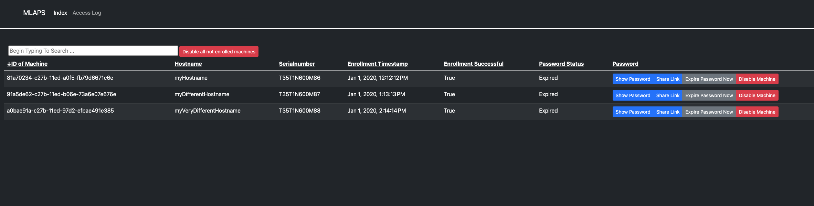
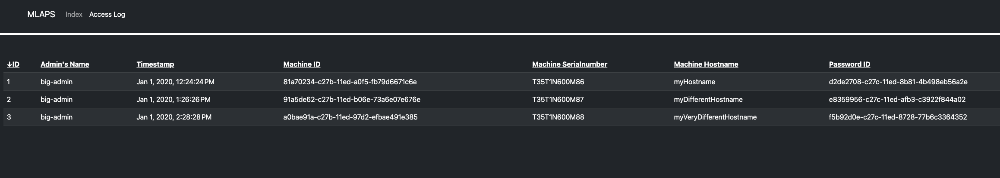

# MLAPS

<p align="center">
  
</p>

## Description

Mlaps is aimed to replicate the laps functionality found in the windows wolrd, but for macOS.

Mlaps is a self-contained, secure, automated and modern server-client system where you can manage and view admin passwords for your mac fleet.

Mlaps provides you with a webinterface, where admins can view local admin passwords, issue sharing links for end users and expire the current password.

on the client side, mlaps runs a launchdeamon which runs the mlaps_client.sh three times a day






## Mentions

Shoutout to [Joshua D. Miller](https://github.com/joshua-d-miller) who's [macOSLAPS](https://github.com/joshua-d-miller/macOSLAPS) software i first used and inspired us to evolve the idea to a full server-client system. 

[Laptop icons created by Vectors Market - Flaticon](https://www.flaticon.com/free-icons/laptop)

## Installation (Server)
In order to ensure a clean and easy execution a python virtual environment is used. 

Requirments for this project are:
* Python3 (3.9) installed
* Python Virtalenviroment installed
* Docker and Docker-Compose

## Installation (Client)
In order to use mlaps on your client, you need to make sure, that your desired local account *has not secure token* enabled.

This is required to set the password for the account without knowing the previous password.

This is used to not track the current password on the client or send the current password over the network when rotating password.

This also doesn't allow the managed user account to unlock filevault (if enabled).

Aside from this consideration, your client also needs homebrew to install a few dependencies:

If you dont want homebrew or manage dependencies otherwise, you'll need: 
* jq
* GNU core utilities
***


## SETUP

### Dev Enviroment

1. Ensure Docker is running and you have a internet connection (for pulling all images)
2. Navigate into the project main folder
3. Ensure you have the following entries in your hosts file
```
mlaps.YOURCOMPANY.com  127.0.0.1
auth              127.0.0.1
```

4. Edit the findAndReplaceMe file and fill in the variables with your info.
5. Execute the file with bash
6. Run the following command to start your configured enviroment
```
docker-compose -f docker-compose.base.yml -f docker-compose.dev.yml up --build --force-recreate
```
This can take a few minutes, especially at first startup. Make sure all containers are starting up and are outputing at least some text.
If a container doesnt start or is not outputting anything, shutdown all conainters via CTRL-C and rerun the command. 

Once all containers are running, you can access
- Mlaps/Nginx at https://mlaps.YOURCOMPANY.com
- Keycloak at http://auth:8080 or http://localhost:8080
- Vault at http://localhost:8200
- MySQL at localhost:3306

#### Accessing web interface

In order to access the web interface in the dev environment you need to enroll yourself, since you need a valid certificate to perform mtls.
0. Ensure you configured your environment and it is running.
1. Ensure your support folder exists and run dev_enroll.sh as root/sudo
2. In your support folder you should find your generated certificate (which is not empty), generate a p12 file in order to properly import it into macOS keychain
example: sudo openssl pkcs12 -export -out /tmp/mlaps-crt.p12 -inkey /tmp/mlaps-key -in /tmp/mlaps-crt
3. Give the ownership of the generated p12 file to your user, otherwise macos will throw errors when trying to import a root file as a user
example: sudo chown YOURUSERNAME /tmp/mlaps-crt.p12
4. Import the p12 file
5. Goto to your mlaps and make sure to select the correct certificate 
   1. If mlaps throws a 400 bad request ssl certificate error, you can try to set an identity-preference within keychain and try again in safari
6. On the keycloak login page use dev:dev

#### Troublshooting
If mlaps complains about unknown/missing fields in the database, try removing the db docker container and relaunch docker-compose

### Production

For Production i recommend something like Puppet to manage the reverse proxy and MySQL db. 
Also you NEED TO build your own mlaps image
When launching into production, ensure a valid role_id and secret_id pair is present in the database, as without it the application can not working properly.

HOW TO INSERT NEW IDS PAIR
```
On the vault host (login with root token)

vault read auth/approle/role/client-passwords/role-id # role id
vault write -f auth/approle/role/client-passwords/secret-id # secret id

now insert into mysql locally:
insert into auth_secret VALUES(NULL, "edb58b07-3f8e-32a6-9249-7a6197d132ec", "1c95137f-4a2d-c770-00b8-4ecf4cd
```

For the first launch, create new certificate for server and distribute the CA to all clients
```
# server cert
openssl req -newkey rsa:2048 -keyout client.key -out client.csr

cat client.csr | vault write -format=json pki/sign/mlaps common_name="mlaps.YOURCOMPANY.com" csr=- | jq -r .data.certificate > client.crt
```
#### Build your own production mlaps image

Since the secrets still need to be added (and the starting command will be waiting for a local mysql connection), you will need to build your own mlaps image.

To do that you will need the pusblished, unconfigured dev mlaps image from github or your own build dev image.

If you use the published image, you also need to apply the findAndReplaceMe script in order to complete the code base.

Afterwards you will need 'secrets.ini' and 'secrets.json' respectfully with content of their '-dev' versions in the app folder.

Now you can build your own image using the mlaps-prod.Dockerfile in the docker/mlaps folder.
